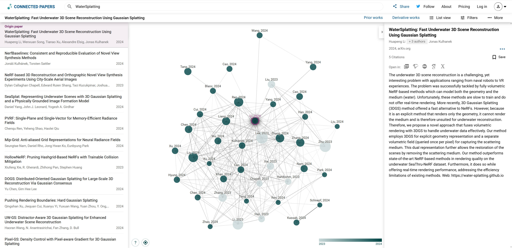

# AquariumDream (or Aquarium4D first?)

## 3/13/2025

### Main Object:
Splitting tasks into different modules.

### Previous Work:

There's no WaterGS4D

### How things going:

1. For Fish:

2. For Scene:
    - [Underwater Gaussian Splatting](https://github.com/water-splatting/water-splatting)
        - [Prepare dataset](https://github.com/deborahLevy130/seathru_NeRF?tab=readme-ov-file#using-your-own-data), using multiple views.
        